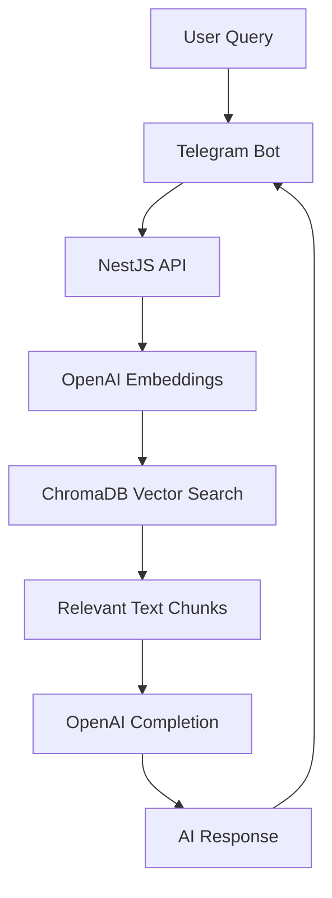

# 📚 Book AI Telegram Assistant

> AI-powered Telegram assistant for classic literature using RAG (Retrieval-Augmented Generation)

Transform any classic book into an interactive AI assistant! Ask questions about plot, characters, themes, and get contextually accurate responses powered by embeddings and vector search.


## ✨ Features

- 🤖 **Smart Q&A**: Context-aware responses using RAG architecture
- 📚 **Configurable Books**: Easy to switch between any Project Gutenberg text
- 🔍 **Vector Search**: ChromaDB for semantic similarity matching
- 🚀 **Production Ready**: Docker, CI/CD, environment configs
- 📱 **Telegram Integration**: Seamless chat interface
- 🧠 **AI-Powered**: OpenAI embeddings and completion models

## 🏗️ Architecture



## 🛠️ Tech Stack

**Backend Framework:**
- NestJS (Node.js framework)
- TypeScript
- Nest Commander (CLI commands)

**AI & ML:**
- OpenAI GPT models
- OpenAI Embeddings (text-embedding-ada-002)
- Unstructured.io (text chunking)

**Vector Database:**
- ChromaDB (embeddings storage & search)

**Integrations:**
- Telegraf (Telegram Bot API)
- Project Gutenberg (free classic literature)

**DevOps:**
- Docker & Docker Compose
- GitHub Actions CI/CD
- Environment-based configuration

## 🚀 Quick Start

### Prerequisites
- Node.js 18+
- Docker & Docker Compose
- OpenAI API key
- Telegram Bot token

### Installation

```bash
# Clone repository
git clone https://github.com/yourusername/book-ai-telegram-assistant.git
cd book-ai-telegram-assistant

# Install dependencies
npm install

# Setup environment
cp .env.example .env
# Edit .env with your API keys
```

### Configuration

Create `.env` file with:

```env
# Required
OPENAI_API_KEY=your_openai_api_key_here
TELEGRAM_BOT_TOKEN=your_telegram_bot_token_here

# ChromaDB Configuration
CHROMADB_URL=http://localhost:8000
CHROMADB_TENANT=default_tenant
CHROMADB_DATABASE=default_database
CHROMADB_COLLECTION=default_collection
CHROMADB_API_KEY=x

# Book Source
BOOK_URL=https://www.gutenberg.org/files/2852/2852-0.txt

# Unstructured.io (for text processing)
UNSTRUCTURED_API_KEY=x
```

### Run Application

```bash
# Start ChromaDB
docker-compose up -d

# Ingest book content (create embeddings)
npm run cli:ingest

# Start development server
npm run dev

# Or production
npm run build
npm run start:prod
```

## 📖 Supported Books

Default: **"The Hound of the Baskervilles"** by Arthur Conan Doyle

**Easy to configure other classics:**
```env
# War and Peace
BOOK_URL=https://www.gutenberg.org/files/2600/2600-0.txt

# Alice in Wonderland  
BOOK_URL=https://www.gutenberg.org/files/11/11-0.txt

# Pride and Prejudice
BOOK_URL=https://www.gutenberg.org/files/1342/1342-0.txt
```

Browse [Project Gutenberg](https://www.gutenberg.org) for 70,000+ free books.

## 🎯 Example Queries

**Plot Questions:**
- *"What is the curse of the Baskervilles?"*
- *"How does the story end?"*

**Character Analysis:**
- *"Describe Sherlock Holmes' personality"*
- *"Who is the main antagonist?"*

**Themes & Analysis:**
- *"What are the main themes in the story?"*
- *"Explain Holmes' deduction methods"*

## 🔧 API Endpoints

```typescript
POST /api/prompt
{
  "query": "Your question about the book"
}
```

**WebSocket Support:**
```typescript
// Connect to WebSocket
socket.emit('message', { text: 'Your question' });
socket.on('response', (data) => console.log(data));
```

## 🐳 Docker Deployment

```bash
# Build and run
docker-compose up --build

# Production deployment
docker-compose -f docker-compose.prod.yml up -d
```

## 🧪 Testing

```bash
# Unit tests
npm test

# E2E tests  
npm run test:e2e

# Coverage
npm run test:cov
```

## 📊 Performance

- **Embedding Generation**: ~2-3 minutes for full book
- **Query Response Time**: ~1-2 seconds
- **Memory Usage**: ~200MB (with embeddings loaded)
- **Supported Concurrent Users**: 100+

## 🤝 Contributing

1. Fork the repository
2. Create feature branch (`git checkout -b feature/amazing-feature`)
3. Commit changes (`git commit -m 'Add amazing feature'`)
4. Push to branch (`git push origin feature/amazing-feature`)
5. Open Pull Request

## 📄 License

This project is licensed under the MIT License - see the [LICENSE](LICENSE) file for details.

## 🙏 Acknowledgments

- [Project Gutenberg](https://www.gutenberg.org) for free classic literature
- [OpenAI](https://openai.com) for powerful language models
- [ChromaDB](https://www.trychroma.com) for vector database
- [NestJS](https://nestjs.com) for the amazing framework

---

**⭐ Star this repo if you found it useful!**